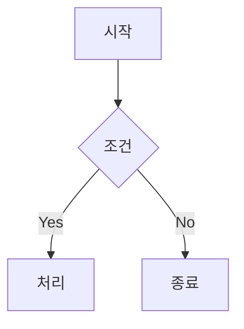
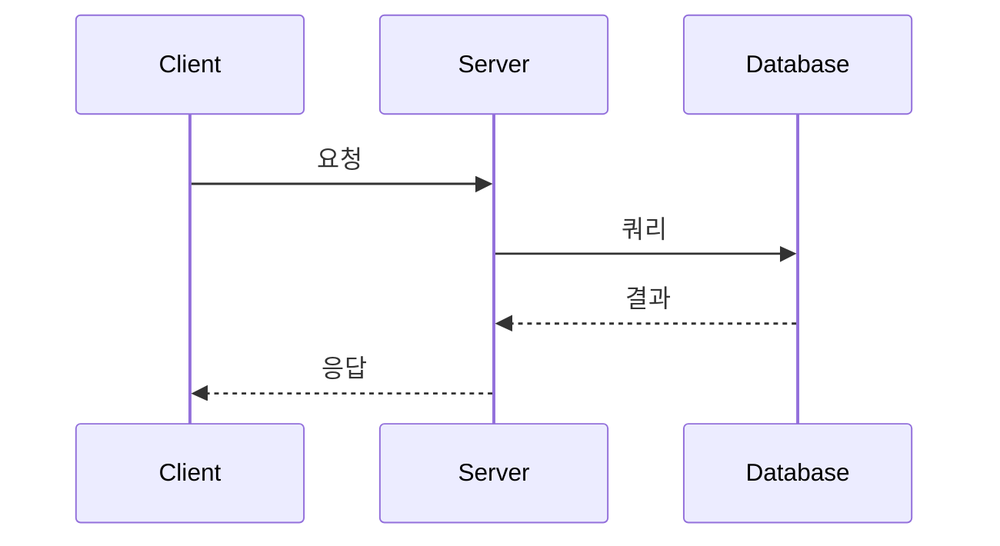

# Markdown 규칙

Markdown 문서 작성 시 적용되는 모범 사례입니다.

---

## 📋 기본 문법

### 제목

```markdown
# H1 제목
## H2 제목
### H3 제목
#### H4 제목
##### H5 제목
###### H6 제목
```

### 텍스트 스타일

```markdown
**굵게** 또는 __굵게__
*기울임* 또는 _기울임_
***굵은 기울임***
~~취소선~~
`인라인 코드`
```

### 링크 & 이미지

```markdown
[링크 텍스트](https://example.com)
[링크 텍스트](https://example.com "툴팁")


<!-- 참조 스타일 -->
[링크][ref]
[ref]: https://example.com
```

---

## 📋 목록

### 순서 없는 목록

```markdown
- 항목 1
- 항목 2
  - 중첩 항목 2.1
  - 중첩 항목 2.2
- 항목 3

* 별표도 가능
+ 플러스도 가능
```

### 순서 있는 목록

```markdown
1. 첫 번째
2. 두 번째
3. 세 번째

<!-- 실제 숫자는 중요하지 않음 -->
1. 첫 번째
1. 두 번째
1. 세 번째
```

### 체크리스트

```markdown
- [x] 완료된 항목
- [ ] 미완료 항목
- [ ] 또 다른 미완료 항목
```

---

## 📋 코드

### 인라인 코드

```markdown
변수 `count`를 사용합니다.
```

### 코드 블록

````markdown
```javascript
function hello() {
  console.log('Hello, World!');
}
```

```python
def hello():
    print("Hello, World!")
```

```bash
npm install package-name
```
````

### 지원 언어 (일부)

```
javascript, typescript, python, php, java, go, rust,
html, css, scss, json, yaml, markdown,
bash, shell, powershell,
sql, graphql,
diff
```

---

## 📋 테이블

```markdown
| 왼쪽 정렬 | 가운데 정렬 | 오른쪽 정렬 |
|:----------|:----------:|----------:|
| 내용 1    | 내용 2     | 내용 3    |
| 내용 4    | 내용 5     | 내용 6    |

<!-- 정렬 표시 -->
| :--- | 왼쪽 정렬
| :--: | 가운데 정렬
| ---: | 오른쪽 정렬
```

---

## 📋 인용 & 구분선

### 인용

```markdown
> 인용문입니다.
> 여러 줄도 가능합니다.

> 중첩 인용
>> 더 깊은 인용

> **팁**: 강조와 함께 사용 가능
```

### 구분선

```markdown
---
***
___

(셋 다 동일한 구분선)
```

---

## 📋 GitHub Flavored Markdown (GFM)

### 자동 링크

```markdown
https://github.com
@username
#123 (이슈/PR 참조)
```

### 이모지

```markdown
:smile: :rocket: :tada: :warning:
```

### 알림 블록 (GitHub)

```markdown
> [!NOTE]
> 참고 사항입니다.

> [!TIP]
> 유용한 팁입니다.

> [!IMPORTANT]
> 중요한 정보입니다.

> [!WARNING]
> 경고 메시지입니다.

> [!CAUTION]
> 주의가 필요합니다.
```

### 접기/펼치기

```markdown
<details>
<summary>클릭해서 펼치기</summary>

숨겨진 내용이 여기에 표시됩니다.

```javascript
const hidden = true;
```

</details>
```

### Mermaid 다이어그램

````markdown



````

---

## 📋 README.md 구조 템플릿

```markdown
# 프로젝트명

프로젝트 설명 한 줄


---

## 📋 목차

- [기능](#기능)
- [설치](#설치)
- [사용법](#사용법)
- [API](#api)
- [기여하기](#기여하기)
- [라이선스](#라이선스)

---

## ✨ 기능

- 기능 1
- 기능 2
- 기능 3

---

## 🚀 설치

### 요구사항

- Node.js 18+
- npm 또는 yarn

### 설치 방법

\```bash
npm install my-package
\```

---

## 📖 사용법

\```javascript
import { myFunction } from 'my-package';

myFunction();
\```

---

## 📚 API

### `myFunction(options)`

| 파라미터 | 타입 | 기본값 | 설명 |
|---------|------|-------|------|
| `name` | `string` | - | 필수. 이름 |
| `count` | `number` | `10` | 선택. 개수 |

---

## 🤝 기여하기

1. Fork
2. Feature branch 생성 (`git checkout -b feature/amazing`)
3. Commit (`git commit -m 'Add amazing feature'`)
4. Push (`git push origin feature/amazing`)
5. Pull Request

---

## 📝 라이선스

MIT License
```

---

## 📋 문서 작성 팁

### 좋은 문서의 특징

1. **명확한 제목**: 내용을 한눈에 파악 가능
2. **목차**: 긴 문서는 목차 제공
3. **예시 코드**: 복사 가능한 실제 코드
4. **스크린샷**: 필요시 시각적 자료 추가
5. **링크**: 관련 문서/리소스 연결

### 포맷팅 가이드

```markdown
<!-- 문장 끝에 마침표 -->
이것은 문장입니다.

<!-- 목록은 일관되게 -->
- 항목 (모두 - 사용)
- 항목
- 항목

<!-- 코드는 언어 명시 -->
```javascript  (O)
```           (X)

<!-- 제목 계층 지키기 -->
# → ## → ### (건너뛰지 않기)
```

---

## 🚫 금지 사항

1. **HTML 남용 금지** (Markdown으로 충분한 경우)
2. **제목 계층 건너뛰기 금지** (H1 → H3 직접 이동)
3. **너무 긴 줄 금지** (80-120자 권장)
4. **이미지 대체 텍스트 누락 금지** (접근성)
5. **깨진 링크 방치 금지** (주기적 확인)
6. **코드 블록 언어 미지정 금지** (구문 강조 필요)
